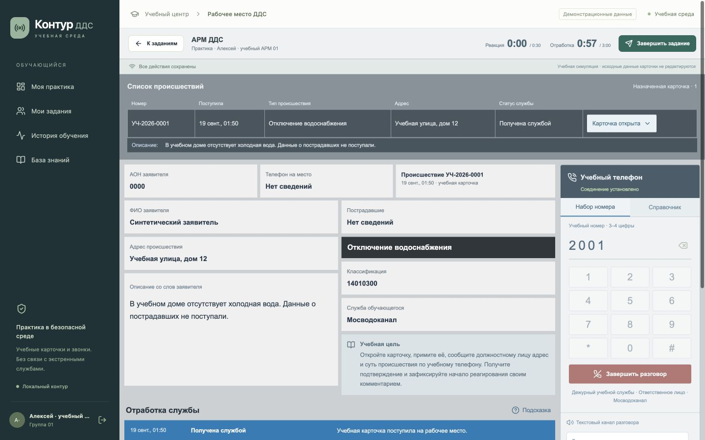
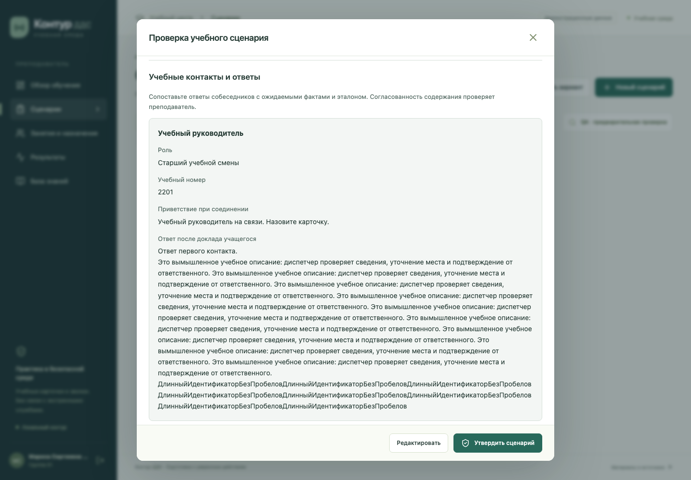

# Контур ДДС — учебный тренажёр обработки карточек 112

Прототип для хакатона ЛЦТ. Основной учебный путь: сотрудник дежурно-диспетчерской службы (ДДС) получает **готовую карточку происшествия**, меняет статусы, фиксирует действия и докладывает через программный телефон. Дополнительно есть небольшой отдельный путь первичного оператора 112: по синтетическому тексту заполнить карточку и выбрать службы. Преподаватель разбирает результаты обоих путей. Это тренажёр, а не система приёма реальных экстренных вызовов.



## В чём проблема

Письменное [задание ЛЦТ](https://i.moscow/hackaton/lct/9852d41aacad40178aaa2c90c627b09a) описывает комплекс подготовки операторов ДДС: реалистичное рабочее место 112, практические ситуации, эмуляция вызовов, контроль времени и действий, оценка, отчёты и управление занятием. Доступ к странице конкурса может требовать авторизации; разбор ниже основан прежде всего на предоставленном PDF ТЗ и приложениях. Требование шире этого прототипа: в PDF есть и путь **первичного оператора 112**, который отвечает на входящий звонок и составляет карточку.

На [Q&A заказчика](https://drive.google.com/file/d/1qpYkmGuSVKPBrBQgC_WB5luTcDzr0ZW9/view?usp=drive_link) подробнее обсуждалась работа **ДДС с уже полученной карточкой**: открыть, обработать, сделать исходящий доклад (17:42–18:51, 21:41–24:11, 39:12–43:19). Поэтому этот путь глубже разработан. Поздние сообщения чата №624–625 и №642 подтверждают, что письменное ТЗ включает и 112; для него добавлен ограниченный текстовый MVP.

Главная продуктовая задача здесь — дать преподавателю способ подготовить достоверное упражнение и быстро понять, **какое действие ученик действительно сделал, когда и на основании каких данных**. Красивый текст ответа сам по себе не означает, что нужный статус был установлен, контакт вызван или факт подтверждён.

## Как исследована задача и почему выбран этот путь

| Что изучено | Метод и вывод | Где проверять |
|---|---|---|
| ТЗ, инструкция, скриншоты АРМ, паспорт РТУ, классификатор | Сопоставлены учебные пути, поля карточки, действия и ограничения локального контура. Отдельно проверены памятка ДДС, 32 билета/96 заданий и отличия классификатора 046.24. | [Реестр источников](research/README.md), [разбор требований](memory-bank/research/2026-09-19-product-discovery.md), [дополнительные материалы](memory-bank/research/2026-09-26-additional-materials.md) |
| Q&A, 65:45 | Полная локальная машинная расшифровка; семь ключевых фрагментов повторно проверены другой моделью. Заказчик несколько раз выделил готовую карточку ДДС, программный исходящий звонок и контроль преподавателя. Расшифровка не вычитана человеком. | [Таймкоды и методика](memory-bank/research/2026-09-19-qa-and-feasibility.md) |
| Telegram Q&A, 582 сообщения | Разделены прямые ответы заказчика, пересказ модератора и предположения участников. Уточнены две роли, 30 секунд до открытия, 3 минуты до первого статуса с текстом и длительный цикл работ; при расхождении источников сохранены ID сообщений. | [Проверенный журнал уточнений](memory-bank/research/2026-09-28-chat-qa-audit.md) |
| Десять аналогов | По открытым материалам сравнивались российские учебные комплексы 112 и тренажёры диспетчеров, в том числе [Equature SmartSim](https://equature.com/solutions/smartsim) и [Sim911](https://arxiv.org/abs/2412.16844). Категория уже существует; универсальный AI-звонящий не является доказанной уникальностью. Возможности коммерческих систем в основном известны из заявлений поставщиков, не из наших испытаний. | [Сравнение и источники](memory-bank/research/2026-09-19-market-research.md) |
| Идеи и оценивание | Сформулированы 12 гипотез, до реализации составлены 40 синтетических сложных случаев для оценщика. Позже воспроизведён дефект рекомендаций: предлагалось упражнение, где слабый навык вообще не проверялся; подбор исправлен по рубрике. | [Продуктовый ресёрч](docs/product-research.md), [набор случаев](docs/validation-cases.json), [проверка улучшений](docs/product-deepening.md) |

**Почему именно этот MVP:** он следует повторному уточнению заказчика и позволяет показать учебный цикл целиком: карточка → решение → доклад → проверяемый разбор → следующий навык. Вместо обещания безошибочного «ИИ-судьи» итог остаётся под контролем преподавателя: доступные локальные модели ошибались в содержательных проверках ([сравнение моделей](docs/model-comparison.md)). Локальный текстовый цикл работает без модели и интернета после подготовки зависимостей.

Это **кабинетный ресёрч**, а не подтверждение пользы в учебном центре. Интервью, наблюдений занятий, методистского утверждения рубрик и пилота с учащимися не было. Снижение времени преподавателя на 20% записано как цель будущего пилота, не как достигнутый результат. [Протокол проверки на людях](docs/pilot-protocol.md).

## Что работает сейчас

1. **Преподаватель** создаёт или генерирует черновик сценария, правит карточку, контакты и критерии, просматривает условия целиком, утверждает и назначает сценарий выбранным ученикам. Попытка получает неизменяемый снимок версии сценария.
2. **Ученик ДДС** видит только свои задания и доступные ему поля готовой карточки, открывает её, записывает статусы и содержательные комментарии, набирает учебный 3–4-значный номер, передаёт доклад и фиксирует ответ. Преподаватель может одновременно «доставить» несколько назначенных карточек: часы каждой идут с общей серверной отметки, в том числе пока карточка ожидает в очереди. Таймеры показывают время до открытия и до первого сохранённого статуса с текстом; завершение работ ими не ограничено.
3. **Система** сохраняет события с защитой от дублей, проверяет формальные действия, время и ограниченный набор фактических признаков; спорное оставляет на просмотр. Отчёт связывает критерии с конкретными событиями.
4. **Преподаватель** принимает отдельное решение по критерию с причиной, затем утверждает общий итог. Первоначальный автоматический результат сохраняется. После нескольких подтверждённых попыток система предлагает упражнение, рубрика которого действительно проверяет повторяющийся слабый критерий; назначение остаётся решением преподавателя.
5. **Администратор** управляет пользователями, смотрит сводное состояние и аудит, создаёт резервную копию вручную.
6. **Ученик 112** читает одну из двух синтетических вводных, самостоятельно заполняет поля карточки и выбирает службы. Система показывает послойное сравнение с авторским эталоном, преподаватель сохраняет заключение. Это отдельное текстовое упражнение: живой звонок, территориальная маршрутизация и связка с карточкой ДДС пока отсутствуют.

Восемь демонстрационных сценариев и пользователи вымышлены. [Сценарий показа](docs/demo-script.md). Пример предпросмотра:

Где это находится в коде: [сценарии и утверждение](backend/app/routes/scenarios.py), [назначения, события, звонки и разбор](backend/app/routes/sessions.py), [правила оценивания](backend/app/assessment.py), [подбор следующего упражнения](backend/app/recommendations.py), [путь 112](backend/app/routes/intake112.py), [преподавательский предпросмотр](frontend/src/components/ScenarioPreview.tsx) и [отчёт](frontend/src/pages/Report.tsx).



## Сверка с письменным ТЗ

Статус «частично» означает конкретную реализованную часть, **не приёмку всего пункта**. Полная [матрица требований, кода и проверок](docs/coverage.md) содержит более мелкие требования.

| Требование PDF ТЗ | Сделано | Осталось / статус |
|---|---|---|
| Учебный АРМ и обработка карточек ДДС; роли и задания | Сквозной поток готовой карточки, три роли, назначение, история и отчёт | **Частично:** нет полного управления учебными группами и всех процессов 112 |
| Входящий звонок и составление карточки первичным оператором 112 | Два фиксированных синтетических текстовых случая: ввод полей, выбор служб, сравнение с эталоном и заключение преподавателя | **Частично:** нет входящего голоса/диалога, авторских сценариев 112, территориальной маршрутизации и передачи карточки в ДДС |
| Виртуальная IP-телефония и реальный голос | Сценарный программный исходящий звонок; локальные ASR/TTS опциональны | **Частично:** нет SIP, аппаратного РТУ и проверенной задержки VoIP ≤150 мс |
| Генерация сценариев, эталоны, контроль преподавателя | Шаблонный черновик; опционально локальная LLM формулирует части; редактор, предпросмотр, утверждение, аудит правок | **Частично:** нет загрузки материалов для дообучения и контекстной перегенерации по замечанию преподавателя |
| Автоматическая оценка смысла, грамматики и действий | Проверяемые правила событий, времени, узких смысловых признаков; покритериальный разбор человеком | **Частично:** универсальная достоверная нейросетевая оценка и полноценная грамматика не реализованы |
| Адаптивное обучение и аналитика | История, CSV, объяснимый подбор по повторяющимся подтверждённым слабым критериям | **Частично:** не обучаемый ML-прогноз; полезность рекомендации на реальных учениках не проверена |
| Случайные серии карточек, выбор сгенерированных/ученических/смешанных | Учитель может одновременно доставить несколько заранее назначенных карточек; ученик переключается между ними, независимые часы идут в очереди | **Частично:** нет случайной серии, выбора типа источника для серии и автоматической выдачи следующей карточки |
| Безопасность и локальная эксплуатация | Разделение ролей, сессии, журнал действий, локальная БД, ручной backup, буферизация событий | **Частично:** нет проверенного TLS-развёртывания, ежедневного backup, шестимесячного хранения журналов и кластерной отказоустойчивости |
| Производительность и целевая среда | Короткий тест API: 100 разных учётных записей, 20 попыток, 300 чтений/200 записей/20 отчётов без ошибок; браузерный тест восстановления после контролируемого сбоя | **Не подтверждено** на целевом i5/16 ГБ, Windows/Ubuntu, PostgreSQL, SIP и длительном голосовом занятии; HTTP-записи не равны 100 операциям БД/с |
| Дополнительные модули и форматы | JSON API, CSV, узкий экран Chromium, классификатор 046.11 | **Частично:** нет Excel/PDF-экспорта отчётов, тепловых карт, XML legacy и миграции классификатора 046.24 |

## Что с критериями жюри

В разделах 16–17 PDF названы критерии, но **нет числовых весов**. Внутренние 100 баллов ученика в тренажёре не являются баллами конкурса.

| Критерий | Статус | Что можно показать / что пока не доказано |
|---|---|---|
| Идея, оригинальность и соответствие задаче | **Частично** | Выбор пути ДДС по Q&A, сравнение аналогов, законченный цикл с проверкой преподавателя. Уникальность на всём рынке и учебный эффект не доказаны. |
| Техническая проработка, интегрируемость, скорость | **Частично** | Исходный код, API, регрессионные тесты, короткий HTTP-прогон и локальный браузерный путь. Работа на всей целевой инфраструктуре и при долгой нагрузке класса не проверена. |
| Достоверность расчётов, прогнозов и рекомендаций | **Не закрыто на реальных данных** | Есть [воспроизводимый отчёт](docs/evaluation-report.md) о 48 синтетических утверждениях: покрыто 28, точное совпадение среди покрытых 27. Это не точность на реальных попытках; проверка реальных рекомендаций не проводилась. |
| Настраиваемость, диаграммы, UX | **Частично** | Есть сложность, профиль службы, два таймера, обзор результатов, desktop и узкий экран. Объективность визуализаций и удобство для реальных преподавателей/учеников не измерены. |
| Сопроводительная документация | **Артефакты готовы; оценка жюри впереди** | Этот README, [документация PDF](deliverables/kontur-dds-documentation-v2.pdf), [презентация PDF](deliverables/kontur-dds-defense-v2.pdf) и [PPTX](deliverables/kontur-dds-defense-v2.pptx). PDF и презентация отражают RC2; новые изменения RC3 описаны в репозитории. |
| Питч-сессия | **Не проведена** | Готовые слайды ещё не показывались жюри. |

Список выше не означает, что критерий «полностью закрыт» техническим тестом. Особенно важный пробел перед защитой — **нет проверки прогнозов и рекомендаций относительно реальных значений**, прямо названной в финальных критериях.

## Технически: устройство, запуск и проверка

`frontend/` — React 19/TypeScript/Vite; `backend/app/` — FastAPI, права, сценарии, события и оценивание; `backend/data/` — синтетические примеры и нормализованный классификатор; `scripts/` — запуск, импорт, backup и локальные AI-сервисы. По умолчанию — один локальный сервер и SQLite WAL. PostgreSQL URL предусмотрен, но PostgreSQL не испытывался. [Архитектура](docs/architecture.md), [API](docs/api-contract.md), [готовность и ограничения](docs/release-readiness.md).

Для запуска из исходников нужны Python 3.12/3.13, `uv`, Node.js 22 и npm. Первый запуск устанавливает зависимости и собирает браузерный код:

```sh
./scripts/start.sh
```

Затем откройте `http://127.0.0.1:8000`. После подготовки зависимостей и сборки возможен локальный запуск без установки:

```sh
./scripts/start.sh --offline
```

Демо-логины: `teacher`, `student`, `admin`; пароль `Demo112!`. Они создаются только в демонстрационном режиме и не подходят для производственного развёртывания. [Подробный сценарий демонстрации](docs/demo-script.md), [офлайн-установка macOS arm64](docs/offline-install.md), [резервное копирование](docs/backup-restore.md).

Текущая техническая регрессия: 156 backend-, 32 системных и 16 клиентских тестов; TypeScript/Vite build. Отдельный [smoke публичного checkout](docs/public-release-smoke.md) подтвердил 156 backend-тестов и локальный запуск HTTP с пустым классификатором. Ранее проведённый Chromium QA на ширинах 1440/390 px относится к RC3; новые очередь и путь 112 пока не проходили пользовательское исследование. Это технические проверки, не педагогический пилот. [Отчёт синтетической оценки](docs/evaluation-report.md), [текущая матрица жюри](docs/jury-evidence.md), [протокол прежнего UI-прогона](docs/rc3-ui-validation.md). Изолированный macOS offline ZIP ранее проверен для RC2; новый код и презентация v3 не следует выдавать за тот архив.

Для хакатонной подачи PDF ТЗ отдельно требует четыре доступные ссылки: код, презентация, прототип и сопроводительная документация. Публичный [репозиторий](https://github.com/StreveSuksess/kontur-dds-lct26) содержит открытый исходный код, [презентацию v3](deliverables/kontur-dds-defense-v3.pptx), [страницу проверки прототипа](docs/prototype.md) с актуальным [озвученным монтажом RC4](deliverables/kontur-dds-demo-v4.mp4) и [PDF-документацию v3](deliverables/kontur-dds-documentation-v3.pdf). Монтаж показывает отдельные реальные экраны 112 и ДДС, но публичного live-сервера пока нет. Полный производный классификатор заказчика в публичном репозитории заменён явным пустым маркером; локальный обладатель исходной таблицы может импортировать её по [инструкции](docs/classifier-import.md). Синтетические сценарии ДДС работают без этого файла. Это четыре отдельных доступных артефакта, но **сохранение их URL в личном кабинете конкурса отдельно не подтверждено**.
